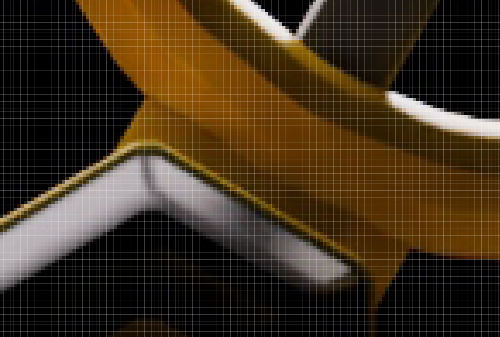
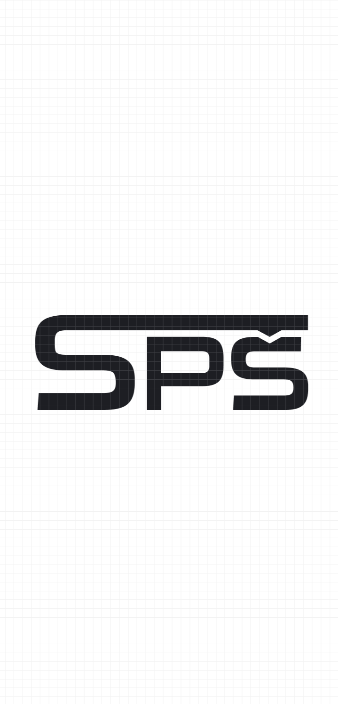
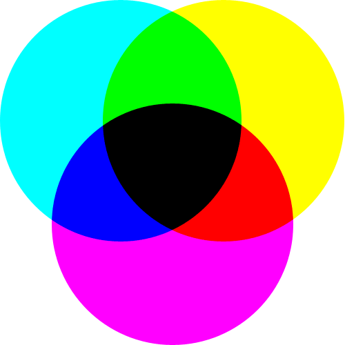
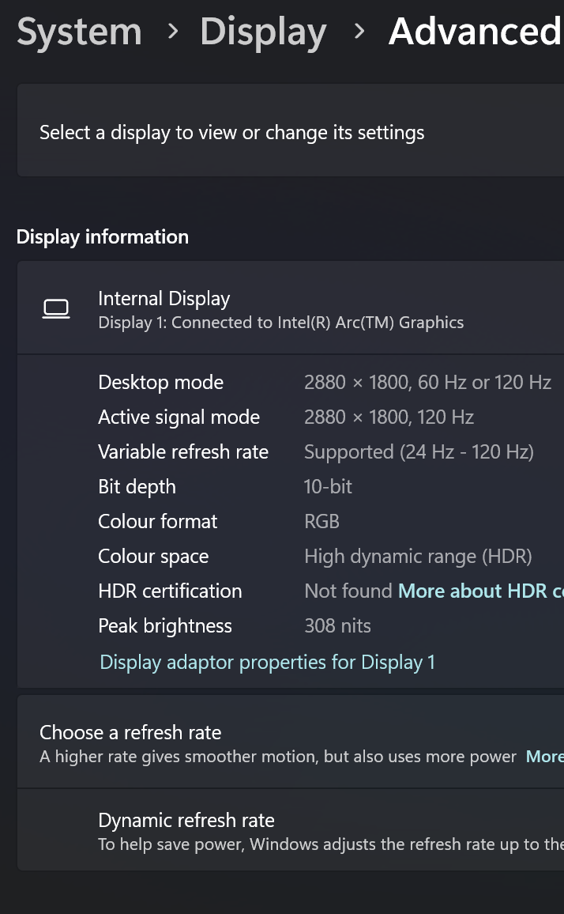

# Počítačová grafika

Karla Kozová 2026

---

## Rastrová grafika
Také nazývána jako Bitmapová grafika
Obraz se skládá z **Pixelů**
Ideální pro fotografie, digitální kresbu, skeny,...
Větší velikosti souborů

---

## Vektorová grafika

Obraz je generován matematicky *(rovnicemi)*
Využívají se **křivky, body, tvary**
Ideální pro loga, ilustrace, typografii, technické výkresy
Dá se zvětšovat bez ztráty detailu

---

## Rastr vs. Vektor
||Rastr|Vektor|
|-|-|-|
|**Skládá se z**|Pixelů|Křivek|
|**Při přiblížení**|Rozmazaný/pixelovaný obraz|Beze změny|
|**Vhodné pro**|Digitální kresby, fotografie, skeny|Loga, ilustrace, technické výkresy|
|**Velikost souborů**|Zvedá se s rozlišením obrazu|Zvedá se s množstvím prvků|
|**Programy**|Adobe Photoshop, Krita, Gimp, MS Paint, Photopea...|Adobe Illustrator, Inkscape, Figma...|

---

## Komprese grafických dat
Snížení datové náročnosti pro ukládání a přenos souborů
### Ztrátová komprese
Odstraní některá data, která člověk nemusí na první pohled vnímat
Např. snížení počtu barev průměrováním sousedních podobných polí
Vznik artefaktů, komprese je vidět
### Bezztrátová komprese
Zachovává 100 % původních informací, výsledná velikost souboru je větší než u ztrátové komprese

---

## Běžné grafické formáty
|Formát|Typ|Komprese|Průhlednost|Využití|
|------|---|--------|-----------|-------|
|**JPEG**|Rastr|Ztrátová|Ne|Fotografie|
|**PNG**|Rastr|Bezztrátová|Ano|Webová grafika|
|**GIF**|Rastr|Ztrátová|Ano*|Jednoduché animace|
|**WEBP**|Rastr|Obě|Ano|Moderní web. grafika|
|**SVG**|Vektor|-|Ano|Loga, ilustrace|
|**RAW**|Rastr|Ne|Ne|"Surová" data z foťáku|

<footer>*GIF podporuje pouze 256 barev, využitím alfa kanálu jednu z nich definujete jako průhlednou => 1bit alfakanál, umožňuje jen zapnout nebo vypnout pixel

---

## Rozlišení
Určuje ostrost obrazu ve výsledném výstupu
Důležité při vytváření grafiky pro různá zařízení a při tisku
Měří se v DPI a PPI
 - DPI - Dots Per Inch (Tečky na palec) - pro tisk
 - PPI - Pixels Per Inch (Pixely na palec) - pro obrazovky

---

## Konverze
### Rastr->Vektor => Vektorizace (trasování)
Počítač hledá v bitmapové grafice hrany, převádí je na křivky
### Vektor->Rastr => Rasterizace
Nevratný proces, jednoduchý proces. Dá se jednoduše zreplikovat screenshotováním vektorové grafiky :-)

---
## Barevné modely
Matematické modely popisující barvu rozkladem na její složky
Dělí se na **Aditivní** a **Subtraktivní**

---

## Aditivní
Využívá k míchání **světlo**
Na jejím základě fungují monitory
**RGB** - 3 kanály:
- Red (Červená)
- Green (Zelená)
- Blue (Modrá)

Svítí-li všechny 3, výsledkem je **bílá**
Zhasnou-li všechny 3, výsledkem je **černá**

---

## Subtraktivní
Využívá k míchání **pohlcování světla**
Využívá se v tisku, malování,...
**CMYK** - 4 barvy:
- Cyan (Azurová)
- Magenta (Purpurová)
- Yellow (Žlutá)
- Key (Klíč) => většinou se používá **černá**

Smícháme-li pouze CMY, vznikne hnědá/tmavá "břečkovitá" barva. Proto se k nim navíc používá černý inkoust.

---

## Barevná hloubka

Určuje počet bitů využitých pro popis barvy jednoho pixelu
### Typické hloubky
**1bit** - černá a bílá
**8bit** - 256 barev (př. GIF)
**8bit/kanál** - 8bit pro každý z kanálů RGB, celkem 16,7 milionů barev
**10bit/kanál** - Využíváno v HDR displejích, celkem 1,07 miliard barev

---

## Histogram
Grafické znázornění distribuce jasu ve fotce
Umožňuje zhodnocení expozice fotky (Zda se detail neztrácí v moc tmavých stínech či naopak v moc světlých světlech)
<footer>https://www.milujemefotografii.cz/jak-pracovat-s-histogramem-pri-uprave-fotek</footer>