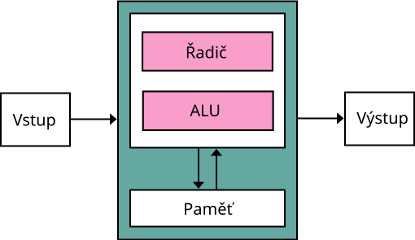

# Architektury počítačů

Karla Kozová 2026

---

## Co to je architektura počítače?
- Definuje logické uspořádání a propojení jednotlivých částí počítače
- Určuje jak procesor komunikuje s pamětí a se vstupně-výstupními (I/O) zařízeními
- **Sběrnice** => soustava vodičů, která komponent umožňuje propojit se zbytkem počítače. Dělí se na:
    - **Adresovou** - určuje kam se zapisuje a odkud se čte
    - **Datovou** - přenáší data a instrukce
    - **Řídicí** - přenáší řídicí signály

---

## Von Neumannova architektura (1945)
- Data i instrukce programu jsou uloženy ve **společné paměti**
- Počítač zpracovává instrukce jednu po druhé => **sekvenčně**
- Data a instrukce se přenáší po stejné datové sběrnici

---

## Komponenty Von Neumannovy architektury
1. **ALU (Aritmeticko-logická jednotka)** - provádí matematické a logické operace
2. **Řadič (Control Unit)** - čte instrukce z paměti, dekóduje je a řídí chod ostatních částí
3. **Operační paměť** - společná pro data i instrukce
4. **Vstupní zařízení** - slouží k zadávání dat a programů (klávesnice, myš, disketová mechanika)
5. **Výstupní zařízení** - zobrazuje výsledky (monitor, tiskárna)

---

<footer>Autor: Kapooht, přeložil Urus – https://en.wikipedia.org/wiki/File:Von_Neumann_Architecture.svg, CC BY-SA 3.0 cz, https://commons.wikimedia.org/w/index.php?curid=30520645</footer>

---

## Von Neumannovo úzké hrdlo (Bottleneck)
- zásadní problém této architektury
- paměť je společná - CPU nemůže číst instrukci a data zároveň => čekání, ztráta času

---

## Harvardská architektura
- Vznikla jako řešení bottlenecku
- **Základní princip** - Paměť je fyzicky rozdělena na 2 části:
    - Jedna paměť a sběrnice výhradně pro **data**
    - Druhá paměť a sběrnice výhradně pro **instrukce**
- Procesor může v jednom taktu zároveň číst data a instrukci 
- Používána u mikrokontrolerů (Arduino) nebo DSP

---

## Srovnání
| Von Neumann | Harvard |
| ----------- | ------- |
| 1 společná paměť | 2 oddělené paměti |
| 1 datová sběrnice | 2 nezávislé sběrnice |
| pomalejší zpracování | rychlejší paralelní přístup |
| jednodušší na výrobu a návrh | složitější HW |
| daty lze přepsat oblast s instrukcemi | instrukce a data se nemohou smíchat |

---

## Smíšená architektura
- Dnes reálně používána v PC a noteboocích
- Spojuje výhody obou konceptů
- Zvenku **RAM** = Funguje jako Von Neumann - jedna společná paměť pro spuštěné programy i jejich data
- Uvnitř CPU **Cache** = Funguje jako Harvard - rychlá mezipaměť (L1 Cache) rozdělena fyzicky na datovou a instrukční cache

